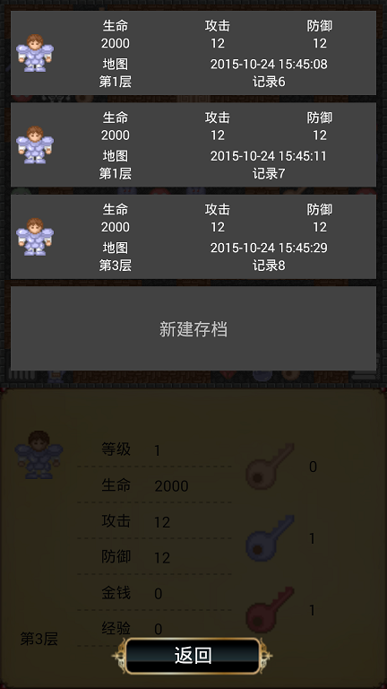

# MagicTower
###魔塔游戏练习, 从经典21层魔塔里面偷来了游戏数据资源，自己做了一下。


###游戏可以自由选择横向，纵向


###任意数量存档，只怕你存储卡空间不够



###解释型游戏控制器，游戏相关数据全部在map文件中，换一组地图，换一个游戏。

###内置小型解释器，计算地图文件中的语法句子，参看：com/cyanflxy/game/parser

###Fragment管理器，有效管理栈中的Fragment
 - 参考FragmentStartManager，BaseFragment
 - 一种管理Fragment的最佳实践
 - 极简化Fragment的启动与关闭，一次写就，再不修改
 - 简化管理Fragment功能回调类，再也不用担心屏幕旋转时忘记设置回调函数

###包含地图编辑器MapCreator, 画地图再也不复杂


## License

```java
/*
 * Copyright (C) 2015 CyanFlxy <cyanflxy@163.com>
 *
 * Licensed under the Apache License, Version 2.0 (the "License");
 * you may not use this file except in compliance with the License.
 * You may obtain a copy of the License at
 *
 *      http://www.apache.org/licenses/LICENSE-2.0
 *
 * Unless required by applicable law or agreed to in writing, software
 * distributed under the License is distributed on an "AS IS" BASIS,
 * WITHOUT WARRANTIES OR CONDITIONS OF ANY KIND, either express or implied.
 * See the License for the specific language governing permissions and
 * limitations under the License.
 */
```

## About Author
Blog:[http://blog.csdn.net/cyanflxy](http://blog.csdn.net/cyanflxy)

E-mail:[cyanflxy@163.com](mailto:cyanflxy@163.com)

